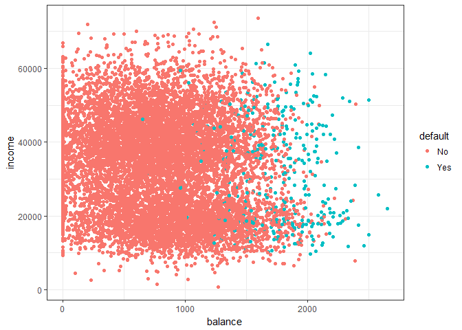
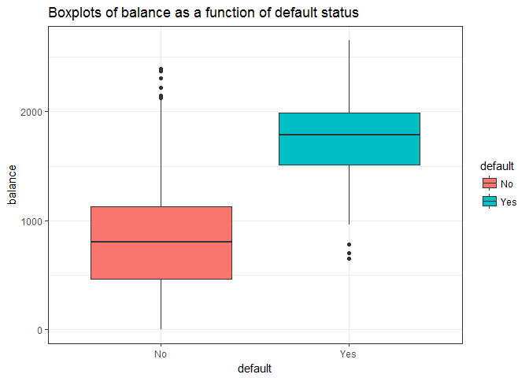
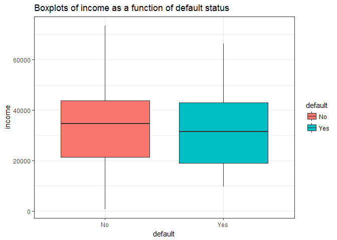
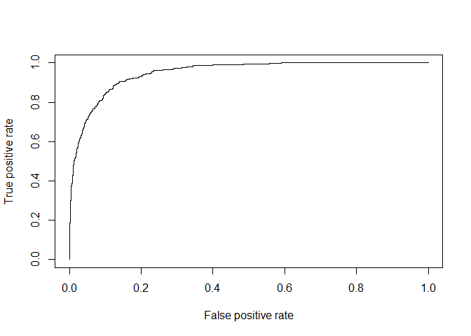
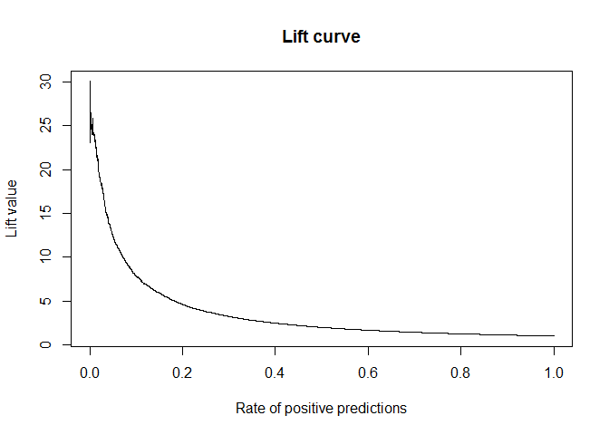

#Introduction

Logistic regression is one of the most common techniques used in various classification problem. This tutorial will intrduce to you this very useful technique, including a case study using R.

## When to use logistic regression
 
- Logistic regression or logit regression is a regression model where the dependent variable (DV) is categorical. Binary logistic regression is a type of regression analysis where the dependent variable is a dummy variable (coded 0, 1).

- Logistic regression is used when analyzing whether some event occurred or not, such as voting, participation in a public program, business success or failure, mortality, a hurricane and etc.

## Logistic model

* Same spirit as linear regression

* Desired interpretation: probability to belong to a specific class for the specified inputs. The target value belongs to [0;1].

* Logistic function: 
        $$Logit(p) = Ln(odds) = ln(\frac{p}{1-p}) = \alpha + \sum_{i=1}^n \beta_iX_i$$
    Or:
                          $$f(t) = \frac{1}{1+ e^{-t}}$$

* Fitting : Find the estimates that max the likehood of obtaining the training sample. 

# An illustration for logistic regression 

## Objective

Analyse the probability of default using the the expalining variables

## The dataset

The dataset has 4 variables, which are: 
   
* Default: Whether the customer has  actually defaulted or not(binary variable)
* Student: Whether he/she is a student (binary variable)
* Balance: Monthly credit card balance 
* Income: Annual income

## Data exploration   

 Let's see the summary of the dataset 

```r
data <- Default
data %>% str
```

```
## 'data.frame':	10000 obs. of  4 variables:
##  $ default: Factor w/ 2 levels "No","Yes": 1 1 1 1 1 1 1 1 1 1 ...
##  $ student: Factor w/ 2 levels "No","Yes": 1 2 1 1 1 2 1 2 1 1 ...
##  $ balance: num  730 817 1074 529 786 ...
##  $ income : num  44362 12106 31767 35704 38463 ...
```

```r
data %>% summary()
```

```
##  default    student       balance           income     
##  No :9667   No :7056   Min.   :   0.0   Min.   :  772  
##  Yes: 333   Yes:2944   1st Qu.: 481.7   1st Qu.:21340  
##                        Median : 823.6   Median :34553  
##                        Mean   : 835.4   Mean   :33517  
##                        3rd Qu.:1166.3   3rd Qu.:43808  
##                        Max.   :2654.3   Max.   :73554
```

```r
data %>% 
  group_by(default) %>% 
  summarise(mean_bal = mean(balance),
            quantile_50_bal = quantile(balance, 0.5),
            mean_inc = mean(income),
            quantile_50_inc=quantile(income,0.5))
```

```
## # A tibble: 2 × 5
##   default  mean_bal quantile_50_bal mean_inc quantile_50_inc
##    <fctr>     <dbl>           <dbl>    <dbl>           <dbl>
## 1      No  803.9438        802.8571 33566.17        34589.49
## 2     Yes 1747.8217       1789.0934 32089.15        31515.34
```

 The first glance:
 
* There is a notable difference in the mean of balance account of those who defaulted and those who did not.
 
Let's also see the plot of annual incomes and monthly credit card balances of individuals

The individuals who defaulted on their credit card payments are shown in blue, those who did not are shown in red.


```r
ggplot(Default, aes(balance, income)) + 
 geom_jitter(aes(color=default)) +
 theme_bw() 
```

<!-- -->
 
 From the scatter plot, we can easily see that those have large balance are highly likely to be defaulted. Regarding to income aspect, the difference between groups is not clear.
 
 We will examine the differences in terms of balance and income of the two groups of individuals. 

 With respect to monthly credit card balance: 

```r
ggplot(Default, aes(default,balance)) + 
  geom_boxplot(aes(fill = default)) +
  ggtitle("Boxplots of balance as a function of default status") +
  theme_bw() 
```

<!-- -->
 
 The plot shows that, there is a significant difference in the monthly balance of those who defaulted and did not default
 

```r
ggplot(Default, aes(default,income)) + 
  geom_boxplot(aes(fill = default)) +
  ggtitle("Boxplots of income as a function of default status") +
  theme_bw() 
```

<!-- -->

```r
aov(income ~ default , data = data) %>% TukeyHSD
```

```
##   Tukey multiple comparisons of means
##     95% family-wise confidence level
## 
## Fit: aov(formula = income ~ default, data = data)
## 
## $default
##            diff      lwr       upr     p adj
## Yes-No -1477.02 -2933.87 -20.16875 0.0469121
```

 There is a slight difference between income of those people who defaulted and did not default.

## Logistic model

 Using logistic regression to predict default = Yes using balance, income and student status. 


```r
lr.fit <- glm(default ~ balance +
                        income +
                        student,
            data = data,
            family = binomial())
summary(lr.fit)
```

```
## 
## Call:
## glm(formula = default ~ balance + income + student, family = binomial(), 
##     data = data)
## 
## Deviance Residuals: 
##     Min       1Q   Median       3Q      Max  
## -2.4691  -0.1418  -0.0557  -0.0203   3.7383  
## 
## Coefficients:
##               Estimate Std. Error z value Pr(>|z|)    
## (Intercept) -1.087e+01  4.923e-01 -22.080  < 2e-16 ***
## balance      5.737e-03  2.319e-04  24.738  < 2e-16 ***
## income       3.033e-06  8.203e-06   0.370  0.71152    
## studentYes  -6.468e-01  2.363e-01  -2.738  0.00619 ** 
## ---
## Signif. codes:  0 '***' 0.001 '**' 0.01 '*' 0.05 '.' 0.1 ' ' 1
## 
## (Dispersion parameter for binomial family taken to be 1)
## 
##     Null deviance: 2920.6  on 9999  degrees of freedom
## Residual deviance: 1571.5  on 9996  degrees of freedom
## AIC: 1579.5
## 
## Number of Fisher Scoring iterations: 8
```

Interpretation of estimated coefficient:

* The variables: balance and student status are highly associated with the probability of default

* The coefficient for dummy variable (student) is negative, indicating that students are less likely to default than non-student (holding other variables constant)

* We see the coefficient estimate for balance (0.0057) indicates that an increase in balance is associated with an increase in the probability of default

* The z-statistic plays the same role as the t-statistic in the linear regression output

* Null Deviance and Residual Deviance should be small. Model is "good" if Deviance is approx Chi^2 with (df_sat - df_model) degrees of freedom.

# Performance of the model

Get the train and test set

```r
bound <- floor((nrow(data)/4)*3)         # define % of training and test set
df <- data[sample(nrow(data)), ]         # sample rows 
df.train <- data[1:bound, ]              # get training set
df.test <- data[(bound+1):nrow(df), ]    # get test set
```

Plot the ROC curve:


```r
pred1 <- prediction(predict(lr.fit), data$default)
perf1 <- performance(pred1,"tpr","fpr")
plot(perf1)
```

<!-- -->

```r
perf <- performance(pred1,"lift","rpp")
plot(perf, main="Lift curve",colorize=F)
```

<!-- -->


